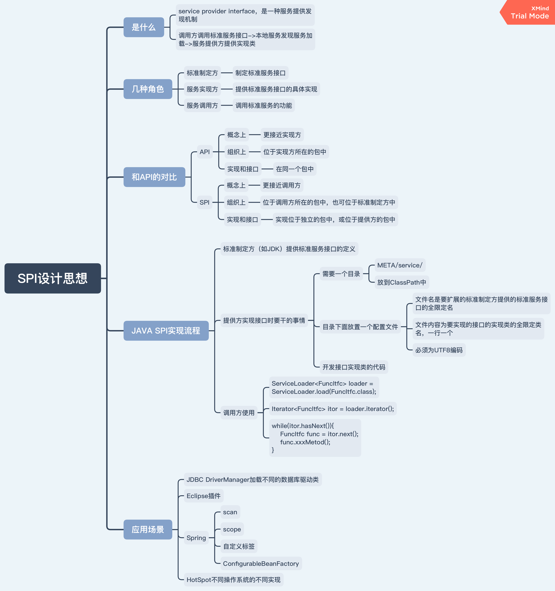

# 这是什么？
SPI设计思想的一个简单demo。

# SPI三种角色
- 标准制定方：制定标准服务接口，该接口可由服务实现方实现，由服务调用方调用。
- 服务实现方：提供标准服务接口的具体实现。
- 服务调用方：调用标准服务接口定义的服务功能。

# 代码结构
- `module/standard`：标准制定方代码目录，定义标准服务接口，不进行具体实现。
- `module/provider`：服务实现方代码目录，提供标准服务接口的具体实现代码。
- `module/caller`：服务调用方代码目录，调用标准服务接口定义的服务功能。

# 验证流程
## 编译、打包`standard.jar`

```
javac -d target -encoding utf-8 src/main/java/com/standard/*.java
jar cvfm standard.jar src/main/resources/META-INF/MANIFEST.MF -C target/ .
```

## 编译、打包`provider.jar`
以下操作都是基于provider根路径。

- 把standard.jar复制到lib目录：

``` shell
cp ../standard/standard.jar ./lib
```

- 编译源代码，把编译结果class放到target目录，并指定外部依赖库路径lib：

``` shell
javac -d target -extdirs lib -encoding utf-8 src/main/java/com/provider/impl/*.java src/main/java/com/provider/*.java
```

- 把lib目录和META-INF目录复制到target目录，以在运行时能找到：

``` shell
cp -r lib target/
cp -r src/main/resources/META-INF target/
```

- 运行主类SearchService：

``` shell
java -cp target;target/lib/standard.jar com.provider.SearchService "com.provider.impl.DatabaseSearcher" "apple"
```

输出结果：
```
start SearchService.getSearcher...
end SearchService.getSearcher
search keyword: "apple" by DatabaseSearcher...
```

- 用jar打包，指定MANIFEST.MF文件（文件中指定了主类和依赖包）：

``` shell
jar cvfm provider.jar target/META-INF/MANIFEST.MF -C target/ .
```

- 运行jar包，输出结果和运行主类SearchService的结果一致：

``` shell
java -jar provider.jar "com.provider.impl.DatabaseSearcher" "apple"
```

## 编译、打包、运行`caller.jar`
以下操作都是基于caller根路径。

- 把provider.jar放到caller的lib目录下：

``` shell
cp ../provider/provider.jar ./lib
```

- 编译：

``` shell
javac -d target -extdirs lib -encoding utf-8 src/main/java/com/caller/*.java
```

- 把lib目录和META-INF目录复制到target目录，以在运行时能找到

``` shell
cp -r lib target/
cp -r src/main/resources/META-INF target/
```

- 执行Main类：

``` shell
java -cp target;target/lib/provider.jar;target/lib/standard.jar com.caller.Main "com.provider.impl.DatabaseSearcher" "apple"
```

输出：

```
start SearchService.getSearcher...
end SearchService.getSearcher
search keyword: "apple" by DatabaseSearcher...
```

- 打成jar包：

``` shell
jar cvfm caller.jar target/META-INF/MANIFEST.MF -C target/ .
```

- 执行jar包，输出结果和运行主类Main的结果一致：

``` shell
java -jar caller.jar "com.provider.impl.DatabaseSearcher" "apple"
```

# 思维导图总结


# 问题总结
## `Could not find or load main class`错误
编译然后运行单个Java类`SearchService`：

``` shell
java com.provider.SearchService
```

报错：

``` 
Error: Could not find or load main class SearchService
```

原因：Java命令运行的时候没有指定classpath，需要指定，像这样：

``` 
java -cp ../../ com.provider.SearchService
```

注：这里的`../../`表示以上上级父路径为包根路径。

## `java.lang.ClassNotFoundException: com.standard.Searcher`报错
在根目录使用下面命令运行代码时候：

```
java -cp target com.provider.SearchService "my keyword" "com.provider.impl.DatabaseSearcher"
```

报错：

```
java.lang.ClassNotFoundException: com.standard.Searcher
```

注：其中`com.standard.Searcher`为jar包中的一个类。

原因：java命令运行时没有指定jar包的classpath，解决办法：

``` shell
java -cp target;target/lib/standard.jar com.provider.SearchService "my keyword" "com.provider.impl.DatabaseSearcher"
```

## 扫描不到在`META-INF/services/com.standard.Searcher`中配置的实现类
使用`java -jar provider.jar`命令执行provider jar包的主类`SearchService`时，代码中并扫描不到在`META-INF/services/com.standard.Searcher`中配置的实现类。

原因：在打包jar包时未把`META-INF`目录复制到`target`目录中。

## 运行时报错`Could not find or load main class com.caller.Main`
编译之后，在根目录使用下面命令执行Main类：

``` shell
java -cp target:target/lib/provider.jar com.caller.Main
```

报错：

``` shell
Error: Could not find or load main class com.caller.Main
```

怀疑：怀疑是未配置MANIFEST.MF文件并在其中指定主类，但是加上之后，问题依旧。

原因：运行使用的java命令`-cp`参数中使用了冒号隔开不同路径，Windows下应该使用分号：

``` shell
java -cp target;target/lib/provider.jar com.caller.Main
```

## 在caller代码中调用provider的代码报错：``
使用下面的命令运行代码，在caller代码中有调用provider的代码：

``` shell
java -cp target;target/lib/provider.jar;target/lib/standard.jar com.caller.Main "com.provider.impl.DatabaseSearcher" "apple"
```

报错：

``` shell
Exception in thread "main" java.lang.NoSuchMethodError: com.provider.SearchService.getSearcher(Ljava/lang/String;)Lcom/standard/Searcher
```

原因：没有把最新的provider.jar放到caller的target/lib目录下。

# 参考资料
- [Java SPI思想梳理](https://zhuanlan.zhihu.com/p/28909673)
